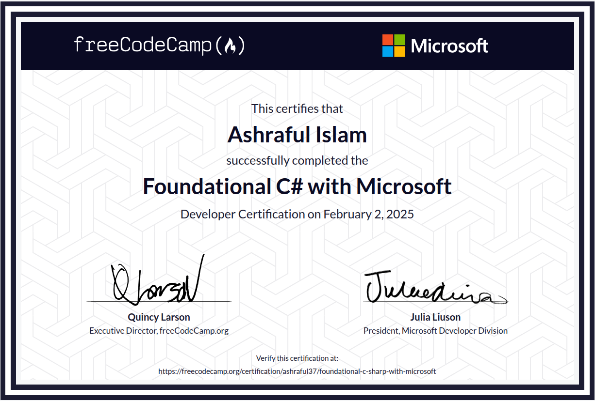

# C# Learning from Microsoft Open Source Platform.

## 🏆 Certification Highlights

- ✅ Successfully completed the Foundational C# with Microsoft Developer Certification.

- 📅 Certified on February 2, 2025 by freeCodeCamp in collaboration with Microsoft.

- 📚 Gained hands-on experience with C# fundamentals, including:

<ul>
<li> Variables, data types, and control flow </li>

<li> Object-oriented programming (OOP) principles</li>

<li> Classes, objects, methods, and interfaces </li>

<li> Error handling and debugging techniques</li>

<li> Working with .NET and the C# runtime environment</li>
</ul>

